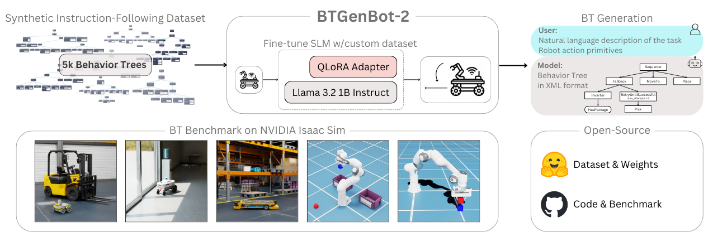

# 🤖 BTGenBot-2: Efficient Behavior Tree Generation with Small Language Models [IJCNN 2026]

[](https://airlab-polimi.github.io/BTGenBot-2/)
[](https://arxiv.org/abs/2602.01870)
[](https://huggingface.co/collections/AIRLab-POLIMI/btgenbot-2)



> **BTGenBot-2** was accepted at the **International Joint Conference on Neural Networks (IJCNN 2026)**. The preprint is available on [arXiv](https://arxiv.org/abs/2602.01870), and the released models and dataset are hosted in the [Hugging Face collection](https://huggingface.co/collections/AIRLab-POLIMI/btgenbot-2).

## 📌 Overview

BTGenBot-2 is a 1B-parameter small language model for generating executable robot behavior trees from natural-language task descriptions and a list of available robot action primitives. The model outputs XML behavior trees compatible with BehaviorTree.CPP, making the generated plans directly usable in standard robotics behavior-tree pipelines.

The paper introduces a standardized benchmark for LLM-based behavior-tree generation with 52 navigation and manipulation tasks in NVIDIA Isaac Sim. In the reported evaluation, BTGenBot-2 achieves average success rates of 90.38% in zero-shot settings and 98.07% in one-shot settings, while providing up to 16x faster inference than the previous BTGenBot model.

For full details, qualitative examples, released checkpoints, and dataset cards, visit the [project page](https://airlab-polimi.github.io/BTGenBot-2/) and the [Hugging Face collection](https://huggingface.co/collections/AIRLab-POLIMI/btgenbot-2).

## 🔗 Resources

| Resource | Link |
| --- | --- |
| Project page | [airlab-polimi.github.io/BTGenBot-2](https://airlab-polimi.github.io/BTGenBot-2/) |
| Preprint | [arXiv:2602.01870](https://arxiv.org/abs/2602.01870) |
| Models and dataset | [Hugging Face collection](https://huggingface.co/collections/AIRLab-POLIMI/btgenbot-2) |
| Local dataset copy | [`dataset/bt_dataset.json`](dataset/bt_dataset.json) |
| Inference notebook | [`model/inference.ipynb`](model/inference.ipynb) |
| Fine-tuning notebook | [`training/llama-3-2-lora-ft.ipynb`](training/llama-3-2-lora-ft.ipynb) |
| Validation report | [`assets/evaluation/validation_results.pdf`](assets/evaluation/validation_results.pdf) |

## 📁 Repository Layout

```text
BTGenBot-2/
|-- assets/                    # USD assets, maps, screenshots, and validation report
|-- dataset/                   # BT dataset and dataset-generation notebooks
|-- images/                    # README and paper figures
|-- index.html                 # Project website entry point
|-- isaac_sim_manipulation/    # Isaac Sim manipulation examples
|-- isaac_sim_navigation/      # ROS 2/Nav2 package for Jackal navigation
|-- model/                     # BTGenBot-2 inference notebook
|-- static/                    # Project website CSS and JavaScript assets
|-- training/                  # LoRA fine-tuning notebook
`-- requirements.txt           # Python research environment
```

## ✅ Prerequisites

- Python environment with the packages in `requirements.txt`.
- Hugging Face access for gated base models and released BTGenBot-2 artifacts.
- CUDA-capable GPU for efficient quantized inference and LoRA fine-tuning.
- NVIDIA Isaac Sim 4.2 for the simulation examples.
- ROS 2 Humble and Nav2 for the navigation benchmark.

## ⚡ Quick Start

Create a Python environment from the repository root:

```bash
python -m venv .venv
source .venv/bin/activate
python -m pip install -r requirements.txt
```

Create a local credential file at `keys/keys.json`. The notebooks resolve this path automatically from either the repository root or their own subfolder.

```json
{
  "HF_TOKEN": "YOUR_HF_TOKEN",
  "WANDB_TOKEN": "YOUR_WANDB_TOKEN",
  "OPENAI_API_KEY": "YOUR_OPENAI_KEY",
  "HF_LLAMA_FT_MODEL": "AIRLab-POLIMI/llama-3.2-1b-it-ft-lora-bt",
  "HF_BT_DATASET": "YOUR_HF_DATASET_REPO",
  "HF_USERNAME": "YOUR_HF_USERNAME"
}
```

Only the credentials required by the selected workflow need to be defined.

## 🌳 Using BTGenBot-2

Run [`model/inference.ipynb`](model/inference.ipynb) to load the fine-tuned checkpoint specified by `HF_LLAMA_FT_MODEL` and generate an XML behavior tree.

The expected input format is:

```text
Task:
Describe the desired robot behavior in natural language.

Actions:
[ActionName (parameters: parameter_1, parameter_2), ...]
```

The expected output is an XML behavior tree only. The notebook extracts the final `<root>...</root>` block and saves it to `model/tree.xml`.

## 📚 Dataset Generation

The released instruction-following dataset is available locally at [`dataset/bt_dataset.json`](dataset/bt_dataset.json) and through the Hugging Face collection. Each sample follows this schema:

- `instruction`: system prompt for XML behavior-tree generation.
- `input`: natural-language task summary plus the allowed action primitives.
- `output`: BehaviorTree.CPP-compatible XML behavior tree.

Dataset construction is documented in:

- [`dataset/bt_dataset_gen.ipynb`](dataset/bt_dataset_gen.ipynb), which generates and validates XML behavior trees.
- [`dataset/instruction_dataset_gen.ipynb`](dataset/instruction_dataset_gen.ipynb), which converts XML trees into instruction-following examples.

## 🛠️ Fine-Tuning

The LoRA fine-tuning workflow is provided in [`training/llama-3-2-lora-ft.ipynb`](training/llama-3-2-lora-ft.ipynb). It fine-tunes `meta-llama/Llama-3.2-1B-Instruct` on the BT instruction dataset, merges the adapter into a standalone checkpoint, and optionally pushes the resulting model to Hugging Face.

Before running it, configure:

- `HF_TOKEN` for Hugging Face authentication.
- `HF_BT_DATASET` for the dataset repository.
- `HF_USERNAME` for the target model repository namespace.
- `WANDB_TOKEN` if logging to Weights & Biases.

## 🎮 Simulation

### Manipulation

Manipulation examples are located in:

```text
isaac_sim_manipulation/omni.btgenbot.v2/
```

Primary entry points:

- `pick_place.py`
- `divide_by_color.py`
- `bt_stacking.py`

Run these scripts from an Isaac Sim Python environment. Depending on the Isaac Sim installation layout, USD asset paths inside the scripts may need to be adjusted to point to this repository.

### Navigation

The navigation package is located in:

```text
isaac_sim_navigation/jackal_navigation/
```

Example build and launch sequence:

```bash
cd isaac_sim_navigation
colcon build --packages-select jackal_navigation
source install/setup.bash
ros2 launch jackal_navigation jackal_navigation.launch.py
```

The package includes Nav2 parameters, RViz configuration, warehouse map files, and Isaac Sim assets for Jackal-based navigation experiments.

## 📊 Evaluation

The validation report is available at:

```text
assets/evaluation/validation_results.pdf
```

It summarizes the evaluation protocol and results reported for BTGenBot-2.

## 📝 Citation

If you use BTGenBot-2 in your research, please cite:

```bibtex
@article{izzo2026btgenbot,
  title={BTGenBot-2: Efficient Behavior Tree Generation with Small Language Models},
  author={Izzo, Riccardo Andrea and Bardaro, Gianluca and Matteucci, Matteo},
  journal={arXiv preprint arXiv:2602.01870},
  year={2026}
}
```

## 👥 Authors

- [Riccardo Andrea Izzo](https://it.linkedin.com/in/riccardo-andrea-izzo-6755b8200)
- [Gianluca Bardaro](https://www.linkedin.com/in/gianluca-bardaro-06640420a/)
- [Matteo Matteucci](https://it.linkedin.com/in/matteo-matteucci-a5b59717)

## 🙏 Acknowledgments

This paper is supported by the FAIR (Future Artificial Intelligence Research) project, funded by the NextGenerationEU program within the PNRR-PE-AI scheme (M4C2, investment 1.3, line on Artificial Intelligence).

## 📄 License and Research Use

The ROS 2 navigation package declares an MIT license in [`isaac_sim_navigation/jackal_navigation/package.xml`](isaac_sim_navigation/jackal_navigation/package.xml). Please check the repository files and the Hugging Face model/dataset cards for license terms associated with individual code, model, data, and asset releases.

This repository is a research artifact. The notebooks and simulation scripts are intended for reproducibility and academic experimentation, and may require environment-specific adjustments for local hardware, Isaac Sim, ROS 2, or Hugging Face access.
